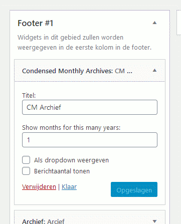
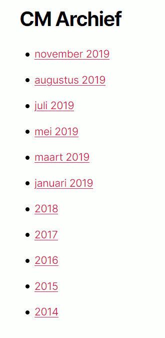

# Condensed Monthly Archive Widget

Like the Wordpress Archives widget, but with the possibility of switching to links to yearly archives after a cut-off year.

## Description

This works like the Wordpress Archives widget, but after a cut-off date (default: 2 years), the widget will display links to yearly archives instead of monthly archives.

The result could for example look like (with a cut-off value of 1): 

* _February 2031_
* _January 2031_
* _2030_
* _2029_

and so on.

The number of years for which months should be shown is user-enterable (see the screenshots).

### Technical description

This copies the code of the Wordpress Archives widget, but adds a field to indicate a cut-off year.

This plugin does not expose the filters that the Archives widget uses, but uses its own filters. 

The plugin also uses its own HTML class name.

The plugin hooks into the wp_get_archives() function using the 'getarchives_where' filter.

## Installation 

Installation works as with any other plugin.

Once installed and activated, the plugin makes a widget available that can be found in the admin menu under Appearance / Widgets.

## Screenshots

Illustration: widget form.

Illustration: archives widget.

## TODO

* Add a proper readme.txt that can be used on wordpress.org.
* Find better ways to deal with nonsensical inputs for the Duration field.
  * Specifically: when value 0 is entered.
  * Specifically: when a non-integer value is entered.
* Make the query for years with posts match the wp_get_archives() filters.

## Changelog 

### 0.1 

* First release.

## Rationale 

I am the maintainer of a weblog that is now 12 years old and as such, a monthly archive is starting to take up quite a bit of space and bandwidth (15 kilobytes and counting). By having a hybrid archive I reduce space while keeping the archive accessible.

## Authors

* Branko Collin.

## License

This project is licensed under GPL2, see https://www.gnu.org/licenses/gpl-2.0.html for more information.

